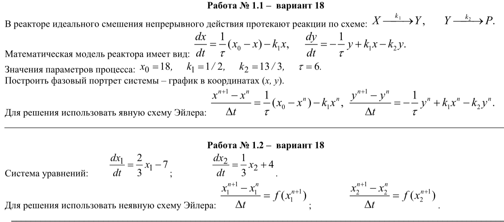
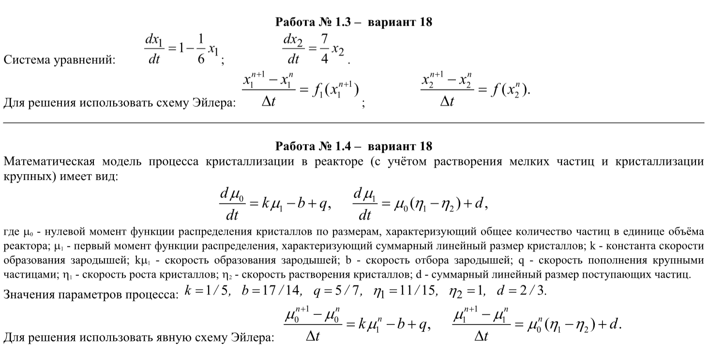
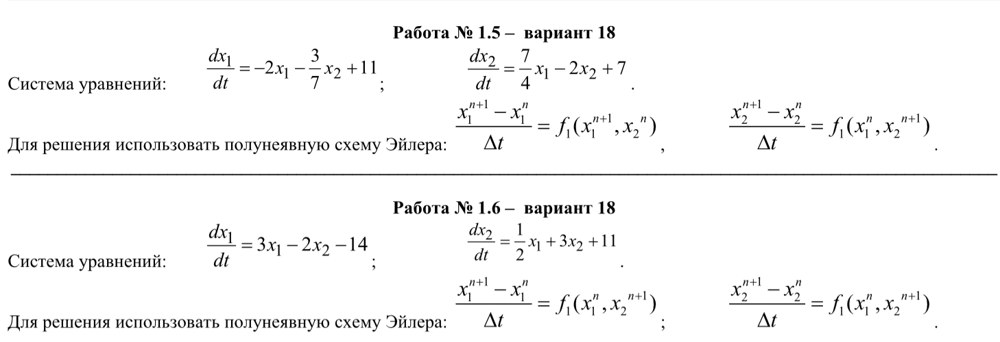

# Оглавление

- [Лабораторный практикум](#лабораторный-практикум)
  - [Описание](#описание)
  - [Лабораторные работы 1-6](#лабораторные-работы-1-6)
  - [Лабораторные работы 7-8](#лабораторные-работы-7-8)
  - [Лабораторные работы 9-10](#лабораторные-работы-9-10)

---

# Лабораторный практикум

## Описание

Лабораторный практикум состоит из трех работ:

Работа 1: лабораторные работы 1-6

Работа 2: лабораторные работы 7-8

Работа 3: лабораторные работы 9-10

## Лабораторные работы 1-6

### Работы 1-2
**Аналитические решения будут прикреплены позже**

Описание задания:

### Работы 3-4

### Работы 5-6

Описание задания:

---

## Лабораторные работы 7-8

### Работы 7-8

---

## Лабораторные работы 9-10

### Работы 9-10
